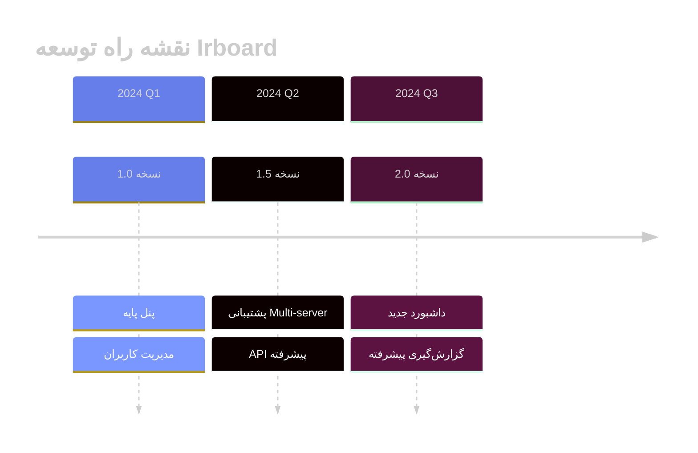

<div align="center">

<!-- Animated Header -->


<!-- Animated Logo -->
<a href="https://github.com/PoriyaVali/Irboard">
  
</a>

<!-- Typing Animation -->
<br/>
<a href="https://git.io/typing-svg">
  
</a>

<br/>

<!-- Animated Badges -->
<p>
  
  
  
  
</p>

<!-- Stats Badges -->
<p>
  
  
  
  
</p>

<!-- Animated Line -->


</div>

<br/>

## ⚡ ویژگی‌های کلیدی

<table>
<tr>
<td width="50%">

### 🎯 عملکرد
- ⚡ پردازش سریع با Redis Cache
- 🔄 مدیریت Queue با Laravel Horizon
- 📊 مانیتورینگ Real-time
- 🚀 بهینه‌سازی خودکار

</td>
<td width="50%">

### 🛡️ امنیت
- 🔐 احراز هویت چندلایه
- 🛡️ محافظت در برابر حملات
- 📝 لاگ‌گیری جامع
- 🔒 رمزنگاری End-to-End

</td>
</tr>
</table>

<br/>

## 📋 پیش‌نیازها

<div align="center">

| 📦 نرم‌افزار | 🔢 نسخه | 📝 توضیحات |
|:---:|:---:|:---:|
|  PHP | `7.3+` | با extensionهای لازم |
|  Laravel | `10.x` | آخرین نسخه پایدار |
|  MySQL | `5.5+` | یا MariaDB 10+ |
|  Redis | `Latest` | برای Cache و Queue |
| 📦 Composer | `Latest` | مدیریت پکیج‌ها |

</div>

<br/>

## 🔧 بک‌اند پشتیبانی شده

<div align="center">

[](https://github.com/PoriyaVali/V2bX)

</div>

<br/>

## 📦 مراحل مهاجرت

<details>
<summary><b>🔹 مرحله ۱: مهاجرت فایل‌های پنل</b></summary>

<br/>

```bash
# تغییر منبع ریپازیتوری
git remote set-url origin https://github.com/PoriyaVali/Irboard

# سوئیچ به شاخه اصلی
git checkout master

# اجرای اسکریپت آپدیت
./update.sh
```

</details>

<details>
<summary><b>🔹 مرحله ۲: پیکربندی کش Redis</b></summary>

<br/>

```bash
# تنظیم درایور کش
sed -i 's/^CACHE_DRIVER=.*/CACHE_DRIVER=redis/' .env

# پاکسازی و بازسازی کش‌ها
php artisan config:clear
php artisan config:cache
php artisan horizon:terminate
php artisan cache:clear
php artisan view:clear
php artisan route:clear
php artisan optimize:clear
```

</details>

<details>
<summary><b>🔹 مرحله ۳: ذخیره مجدد تنظیمات قالب</b></summary>

<br/>

> 📌 وارد پنل مدیریت شوید:
> 
> **تنظیمات قالب** ← **انتخاب قالب default** ← **تنظیمات قالب** ← **ذخیره**

</details>

<br/>

## 🗺️ نقشه راه

<div align="center">



</div>

<br/>

## 📖 مستندات

<div align="center">

[](https://v2board.com)
[](https://github.com/PoriyaVali/Irboard/wiki)
[](https://github.com/PoriyaVali/Irboard/discussions)

</div>

<br/>

## 💖 حامیان

<div align="center">

تشکر ویژه از حامیان پروژه:

<a href="https://www.jetbrains.com/">
  
</a>

<br/>

**[JetBrains](https://www.jetbrains.com/)** - ارائه لایسنس رایگان برای پروژه‌های متن‌باز

</div>

<br/>

## 🤝 مشارکت

<div align="center">

مشارکت شما در توسعه این پروژه ارزشمند است!

[](https://github.com/PoriyaVali/Irboard/pulls)

</div>

1. پروژه را Fork کنید
2. شاخه جدید بسازید (`git checkout -b feature/amazing-feature`)
3. تغییرات را Commit کنید (`git commit -m 'Add amazing feature'`)
4. به شاخه Push کنید (`git push origin feature/amazing-feature`)
5. Pull Request ایجاد کنید

<br/>

## 🐛 گزارش مشکلات

<div align="center">

[](https://github.com/PoriyaVali/Irboard/issues/new?template=bug_report.md)
[](https://github.com/PoriyaVali/Irboard/issues/new?template=feature_request.md)

</div>

<br/>

## 📊 آمار پروژه

<div align="center">


[](https://github.com/PoriyaVali)

</div>

<br/>

<!-- Footer Wave -->


<div align="center">

**ساخته شده با ❤️ توسط [PoriyaVali](https://github.com/PoriyaVali)**

<br/>

[](https://github.com/PoriyaVali)
[](https://t.me/)

<br/>

<sub>⭐ اگر این پروژه برایتان مفید بود، ستاره دادن فراموش نشود!</sub>

</div>
