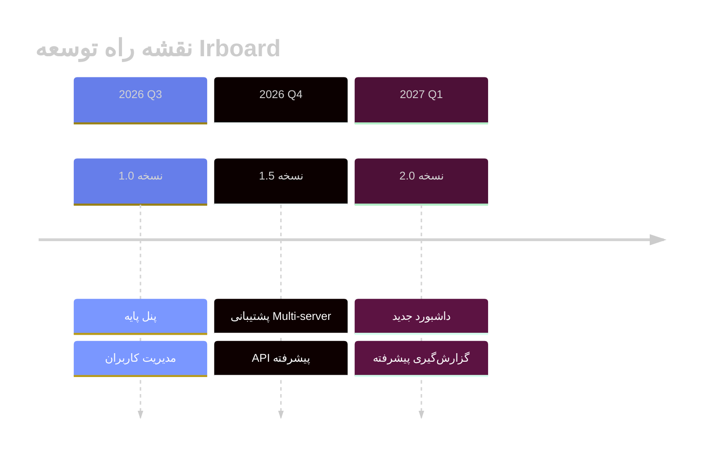

<div align="center">

<!-- Animated Header -->


<!-- Animated Logo -->
<a href="https://github.com/PoriyaVali/Irboard">
  
</a>

<!-- Typing Animation -->
<br/>
<a href="https://git.io/typing-svg">
  
</a>

<br/>

<!-- Animated Badges -->
<p>
  
  
  
  
</p>

<!-- Stats Badges -->
<p>
  <a href="https://github.com/PoriyaVali/Irboard/actions/workflows/ci.yml"></a>
</p>
<p>
  
  
  
  
</p>

<!-- Animated Line -->


</div>

<br/>

<div dir="rtl">

## ⚡ ویژگی‌های کلیدی

<table>
<tr>
<td width="50%">

### 🎯 عملکرد
- ⚡ پردازش سریع با Redis Cache
- 🔄 مدیریت Queue با Laravel Horizon
- 📊 مانیتورینگ Real-time
- 🚀 بهینه‌سازی خودکار

</td>
<td width="50%">

### 🛡️ امنیت
- 🔐 احراز هویت چندلایه
- 🛡️ محافظت در برابر حملات
- 📝 لاگ‌گیری جامع
- 🔒 رمزنگاری End-to-End

</td>
</tr>
</table>

<br/>

## 📋 پیش‌نیازها (نصب روی aaPanel)

<div align="center">

| توضیحات 📝 | نسخه 🔢 | مورد نیاز 📦 |
|:---:|:---:|:---:|
| Debian/Ubuntu یا CentOS با دسترسی root | — | 🐧 سرور لینوکس |
| نصب‌شده در مسیر `/www/server/panel` | `آخرین نسخه` | 🅰️ aaPanel |
| نصب از خود aaPanel | `1.2x` |  Nginx |
| با اکستنشن‌های `redis` `pcntl` `posix` `fileinfo` | `8.1 توصیه‌شده` (حداقل `7.3`) |  PHP |
| یا MariaDB 10+ — نصب از aaPanel | `5.5+` |  MySQL |
| برای Cache ،Session و Queue — در صورت نبود، نصاب خودش نصب می‌کند | `Latest` |  Redis |
| نصب از App Store در aaPanel | `Latest` | 🧩 افزونه Supervisor |
| معمولاً همراه aaPanel موجود است — نصاب بررسی می‌کند | — | 🔧 `git` ، `sqlite3` ، `python3` |
| در صورت نبود، `composer.phar` خودکار دانلود می‌شود | `Latest` | 📦 Composer |

</div>

<br/>

## 🚀 نصب با یک کلیک روی aaPanel

> ⚙️ **آماده‌سازی (یک‌بار، داخل aaPanel):**
> 1. یک **Website** با PHP 8.1 بسازید.
> 2. یک **دیتابیس MySQL** بسازید و به همان سایت متصل کنید — نصاب اطلاعات اتصال را خودش از aaPanel می‌خواند.
> 3. افزونه **Supervisor** را از App Store نصب کنید.
> 4. اکستنشن‌های PHP (`redis` ، `pcntl` ، `posix`) را از مسیر PHP ← Extensions فعال کنید.

سپس فقط همین یک دستور را با کاربر root اجرا کنید:

<div dir="ltr">

```bash
bash <(curl -fsSL https://raw.githubusercontent.com/PoriyaVali/Irboard/main/install.sh) --domain your-panel-domain.com
```

</div>

> 💡 اگر فقط یک سایت در aaPanel دارید، `--domain` لازم نیست — خودکار تشخیص داده می‌شود.

<details>
<summary><b>🔍 نصاب دقیقاً چه می‌کند؟ (۸ مرحله)</b></summary>

<br/>

1. **Preflight** — بررسی root ، aaPanel ، php ، sqlite3 ، python3
2. **Site** — تشخیص دامنه و مسیر نصب از دیتابیس aaPanel
3. **Prerequisites** — نصب Redis و بررسی اکستنشن‌های PHP
4. **Code** — کلون ریپو + اجرای `init.sh` (کامپوزر، ایمپورت دیتابیس، ساخت ادمین) — و اگر پنل از قبل نصب باشد، به‌جای آن آپدیت امن انجام می‌دهد
5. **Nginx** — کپی rewrite و اصلاح document root به `public/`
6. **Supervisor** — ساخت برنامه‌های WebMan ، V2b (Horizon) و agent
7. **Cron** — زمان‌بندی `schedule:run` هر دقیقه
8. **Verify** — تست nginx و supervisor و پاسخ HTTP پنل

</details>

> 🔑 در پایان نصب، **آدرس پنل ادمین + ایمیل + رمز عبور ادمین** نمایش داده می‌شود. رمز فقط **همین یک‌بار** نشان داده می‌شود — همان لحظه ذخیره کنید. (اگر گم شد: اجرای دوباره با `--reset-admin-password`)

> ♻️ نصاب **ایدمپوتنت** است: اجرای دوباره فقط موارد ناقص را تعمیر می‌کند و از هر فایلی که تغییر می‌دهد، بکاپ `‎.bak_irboard_<timestamp>` می‌گیرد.

<details>
<summary><b>⚙️ سوییچ‌های اختیاری</b></summary>

<br/>

<div dir="ltr">

| Flag | کاربرد |
|:---|:---|
| `--domain <name>` | انتخاب دامنه (وقتی چند سایت دارید) |
| `--dir <path>` | مسیر نصب سفارشی (خارج از چیدمان aaPanel) |
| `--reset-admin-password` | صدور رمز جدید برای ادمین و نمایش آن |
| `--skip-install` | رد کردن کلون + init (کد از قبل موجود است) |
| `--no-update` | روی نصب موجود فقط تعمیر کند، آپدیت نکند |
| `--tune-nginx` | اعمال تیونینگ سراسری nginx (پیش‌فرض خاموش) |
| `--force` | ادامه حتی اگر پوشه فایل ناشناخته داشته باشد |

</div>

</details>

<br/>

## 🔄 آپدیت پنل

<div dir="ltr">

```bash
cd /www/wwwroot/your-panel-domain.com
bash update.sh
```

</div>

یا همان دستور نصب یک‌کلیکی را دوباره اجرا کنید — روی پنل نصب‌شده، خودش قبل از آپدیت از دیتابیس بکاپ می‌گیرد (`storage/backups/pre-update_*.sql.gz`) و سپس `update.sh` را اجرا می‌کند.

<details>
<summary><b>🛡️ چرا این آپدیت امن است؟</b></summary>

<br/>

- **Self-updating** — قبل از هر کاری، جدیدترین نسخه‌ی خودِ `update.sh` را از ریپو می‌گیرد و اجرا می‌کند
- **بدون تخریب** — اگر تغییرات لوکال داشته باشید، به‌جای `reset --hard` متوقف می‌شود
- **Fast-forward only** — روی هر شاخه‌ای که checkout شده کار می‌کند (main/master فرقی ندارد)
- **وابستگی‌های تکرارپذیر** — نصب از `composer.lock`
- **دیتابیس افزایشی** — `php artisan v2board:update` فقط جدول/ستون اضافه می‌کند و داده‌ها را دست نمی‌زند
- **وب‌سرور در آخرین مرحله** ری‌استارت می‌شود و در پایان، دستور **rollback** چاپ و سلامت پنل تست می‌شود

</details>

<br/>

## 🔧 بک‌اند پشتیبانی شده

<div align="center">

[](https://github.com/PoriyaVali/V2bX)

</div>

<br/>

## 📦 مهاجرت از V2Board به Irboard

> ⚠️ قبل از شروع، از دیتابیس بکاپ بگیرید:
> <div dir="ltr">
>
> ```bash
> mysqldump -u USER -p DBNAME | gzip > v2board_backup_$(date +%F).sql.gz
> ```
>
> </div>

<details>
<summary><b>🔹 مرحله ۱: مهاجرت فایل‌های پنل</b></summary>

<br/>

<div dir="ltr">

```bash
cd /www/wwwroot/your-panel-domain.com

# تغییر منبع ریپازیتوری
git remote set-url origin https://github.com/PoriyaVali/Irboard

# دریافت آخرین تغییرات و سوئیچ به شاخه اصلی
git fetch origin
git checkout main
git pull origin main

# اجرای اسکریپت آپدیت (کامپوزر + دیتابیس + ری‌استارت سرویس‌ها)
bash update.sh
```

</div>

</details>

<details>
<summary><b>🔹 مرحله ۲: پیکربندی کش Redis</b></summary>

<br/>

<div dir="ltr">

```bash
# تنظیم درایور کش
sed -i 's/^CACHE_DRIVER=.*/CACHE_DRIVER=redis/' .env

# پاکسازی و بازسازی کش‌ها
php artisan config:clear
php artisan config:cache
php artisan horizon:terminate
php artisan cache:clear
php artisan view:clear
php artisan route:clear
php artisan optimize:clear
```

</div>

</details>

<details>
<summary><b>🔹 مرحله ۳: ذخیره مجدد تنظیمات قالب</b></summary>

<br/>

> 📌 وارد پنل مدیریت شوید:
> 
> **تنظیمات قالب** ← **انتخاب قالب default** ← **تنظیمات قالب** ← **ذخیره**

</details>

<details>
<summary><b>🔹 مرحله ۴ (اختیاری): سرویس‌های supervisor و cron را به چیدمان استاندارد Irboard ببرید</b></summary>

<br/>

<div dir="ltr">

```bash
bash <(curl -fsSL https://raw.githubusercontent.com/PoriyaVali/Irboard/main/install.sh) --domain your-panel-domain.com
```

</div>

نصاب ایدمپوتنت است: پنل نصب‌شده را دوباره نصب نمی‌کند، فقط nginx rewrite ، برنامه‌های supervisor و cron را مطابق استاندارد Irboard تنظیم/تعمیر می‌کند.

</details>

<br/>

## 🗺️ نقشه راه

<div align="center">


```mermaid
%%{init: {'theme': 'dark', 'themeVariables': { 'primaryColor': '#667eea', 'secondaryColor': '#764ba2'}}}%%
timeline
    title نقشه راه توسعه Irboard
    section 2026 Q3
        نسخه 1.0 : پنل پایه
                  : مدیریت کاربران
    section 2026 Q4
        نسخه 1.5 : پشتیبانی Multi-server
                  : API پیشرفته
    section 2027 Q1
        نسخه 2.0 : داشبورد جدید
                  : گزارش‌گیری پیشرفته
```

</div>

<br/>

## 📖 مستندات

<div align="center">

[](https://github.com/PoriyaVali/Irboard#readme)
[](https://github.com/PoriyaVali/Irboard/wiki)
[](https://github.com/PoriyaVali/Irboard/discussions)

</div>

<br/>

## 💖 حامیان

<div align="center">

تشکر ویژه از حامیان پروژه:

<a href="https://www.jetbrains.com/">
  
</a>

<br/>

**[JetBrains](https://www.jetbrains.com/)** - ارائه لایسنس رایگان برای پروژه‌های متن‌باز

</div>

<br/>

## 🤝 مشارکت

<div align="center">

مشارکت شما در توسعه این پروژه ارزشمند است!

[](https://github.com/PoriyaVali/Irboard/pulls)

</div>

1. پروژه را Fork کنید
2. شاخه جدید بسازید (`git checkout -b feature/amazing-feature`)
3. تغییرات را Commit کنید (`git commit -m 'Add amazing feature'`)
4. به شاخه Push کنید (`git push origin feature/amazing-feature`)
5. Pull Request ایجاد کنید

<br/>

## 🐛 گزارش مشکلات

<div align="center">

[](https://github.com/PoriyaVali/Irboard/issues/new?template=bug_report.md)
[](https://github.com/PoriyaVali/Irboard/issues/new?template=feature_request.md)

</div>

<br/>

## 📊 آمار پروژه

<div align="center">


[](https://github.com/PoriyaVali)

</div>

</div>

<!-- Footer Wave -->


<div align="center">

**ساخته شده با ❤️ توسط [PoriyaVali](https://github.com/PoriyaVali)**

<br/>

[](https://github.com/PoriyaVali)

<br/>

<sub>⭐ اگر این پروژه برایتان مفید بود، ستاره دادن فراموش نشود!</sub>

</div>
